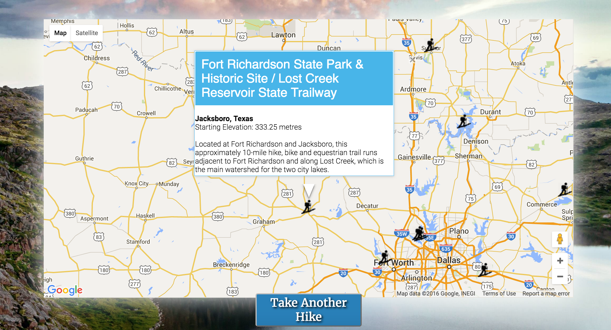

# TakeAHike

##Description

A web application built with a Sinatra back-end that incorporates the TrailAPI and the Google Maps API. The app is hosted on Heroku and allows users to easily find hiking spots near them.

Visit http://gotakeahike.herokuapp.com to check out the app and find your next hiking journey.

##Contributors

* [Ray Curran](https://github.com/ray-curran)
* [Michal Klimek](https://github.com/KlimekM)
* [Sabri Helal](https://github.com/lechiffre10)
* [Marshall Sosland](https://github.com/msosland)

##Screenshots

